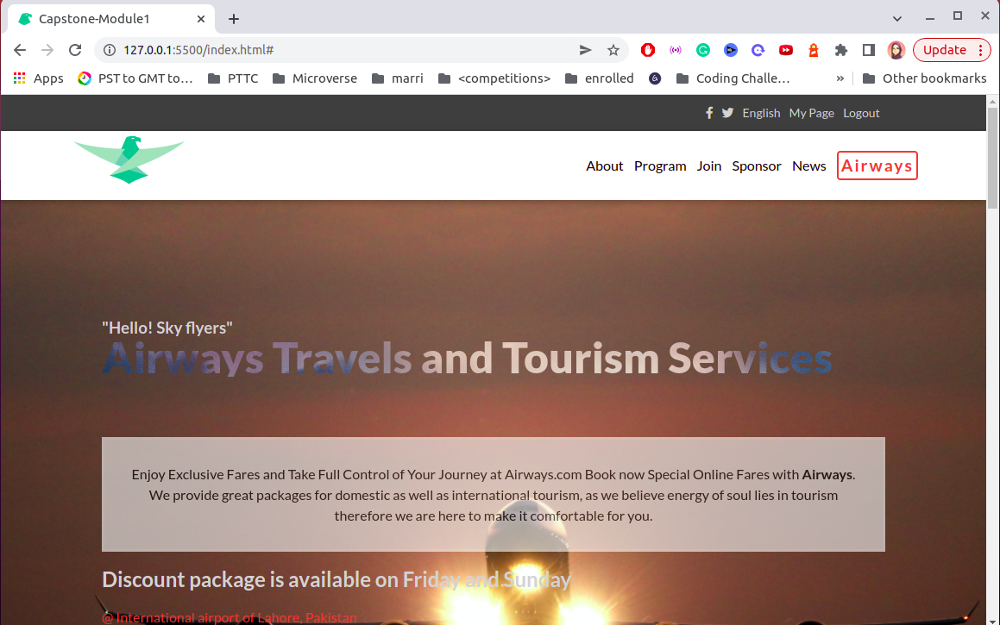
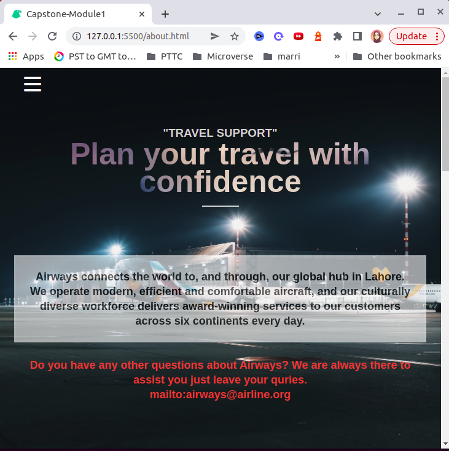

## Capstone-Module1
Airways website build with technologies of HTML5, CSS3 and JS.

## Built With

- Web Development
- HTML5, CSS3, JS

## Project Name

Airways - An airline that encourges toursim throughout the globe and connects the people.

## Workflow screen

- Desktop View of home page

- Mobile view of About page

## Video Presentation

[Click here to view](not available)

## Live Demo

[Click here to view](https://tahseenzahra.github.io/Capstone-Module1/)

## Getting Started

Fork / Clone the repository to use it on your local system.

## Usage

View the file through the source code.

## Authors

👤 **Tahseen Zahra**

- GitHub: [@tahseenzahra](https://github.com/tahseenzahra)
- Twitter: [@tahseen1zahra](https://twitter.com/tahseen1zahra)
- LinkedIn: [@tahseenzahra](https://www.linkedin.com/in/tahseenzahra/)

## Acknowledgements

[Cindy Shin](https://www.behance.net/gallery/29845175/CC-Global-Summit-2015) whose design template was used is used for this project.

Backgroung pictures are taken from Unsplash

Logo is taken from [Abbas Siddiqi](https://abbassiddiqi.com/)

## 🤝 Contributing

Contributions, issues, and feature requests are welcome!

Feel free to check the [issues page](https://github.com/tahseenzahra/Capstone-Module1/issues).

## Show your support

Give a ⭐️ if you like this project!
